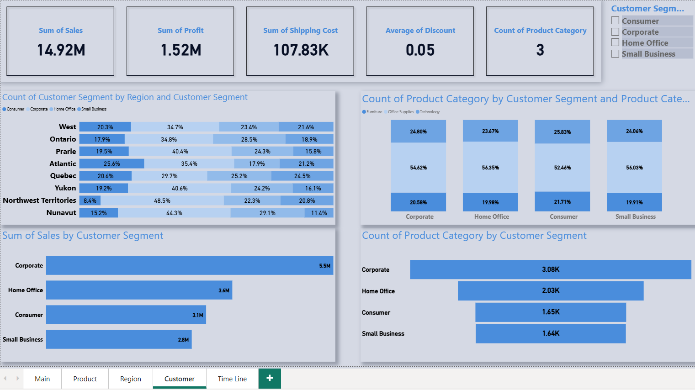

# Sales Performance Dashboard

## Project Overview
This project is an interactive Power BI dashboard designed to analyze retail sales performance and provide valuable business insights.

## Tools Used
- Power BI
- Power Query
- DAX
- Data Modeling

## Dashboard Pages
- Main Dashboard
- Product Dashboard
- Region Dashboard
- Customer Dashboard
- Timeline Dashboard

## Dashboard Preview

## Key Insights
- Analyzed sales, profit, and discount performance.
- Compared regional and product performance.
- Created interactive dashboards using filters and slicers.
- Enabled data-driven decision making through visual analytics.
