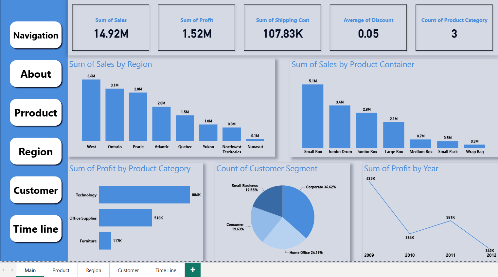
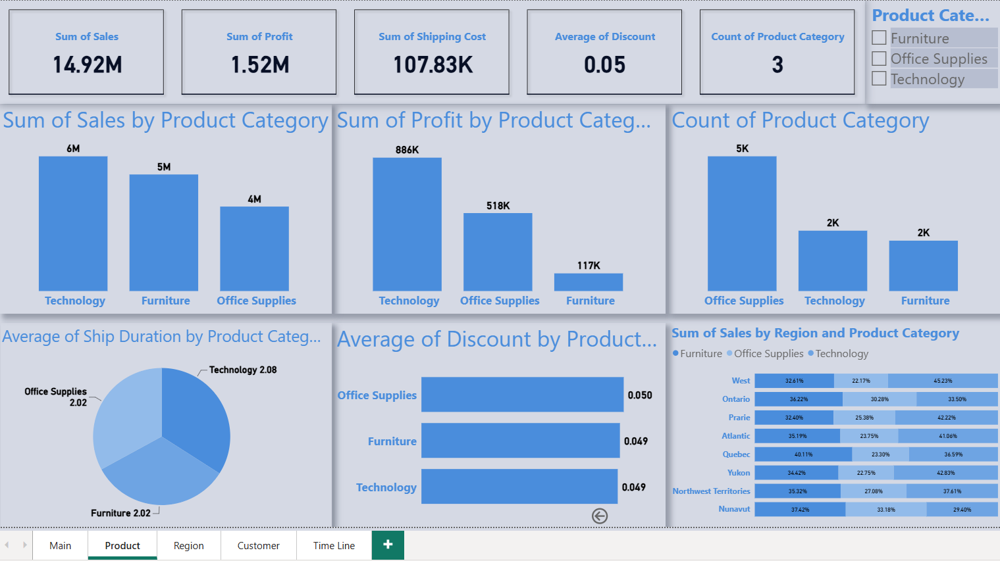
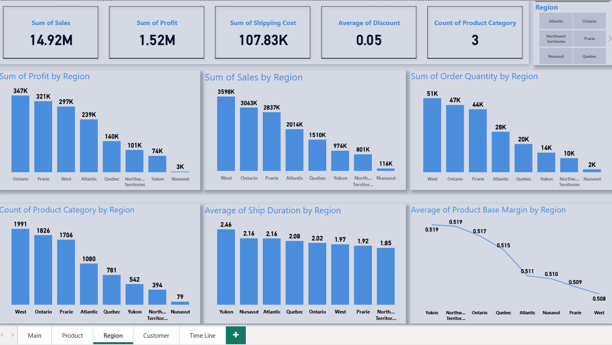

# 📊 Retail Sales Performance Dashboard (2009–2012)

## Project Overview
This project presents an interactive Power BI dashboard for analyzing retail sales performance from 2009 to 2012. It provides business insights into sales, profit, customer behavior, product performance, and regional trends through interactive visualizations.

## Technologies Used
- Microsoft Power BI
- Power Query
- DAX
- Microsoft Excel
- Data Modeling

## Features
- Interactive dashboards with dynamic slicers and filters
- KPI tracking for sales and profit performance
- Customer behavior and purchasing analysis
- Product performance evaluation
- Regional sales comparison
- Time-series sales trend analysis
- Data-driven business insights
- Interactive visualizations for decision-making

## Dashboard Pages
- 🏠 Main Dashboard
- 📦 Product Dashboard
- 👥 Customer Dashboard
- 🌍 Region Dashboard
- 📅 Timeline Dashboard

## Dashboard Preview

### Main Dashboard


### Product Dashboard


### Region Dashboard


### Customer Dashboard


### Timeline Dashboard


## Key Insights
- Evaluated sales and profit performance across the dataset.
- Compared product categories and regional performance.
- Analyzed customer purchasing behavior and sales trends.
- Built interactive dashboards using Power Query, DAX, and data modeling.
- Designed visual reports to support data-driven business decisions.

## Repository Structure

```text
Sales-Performance-Dashboard
│── Sales-Performance-Dashboard.pbix
│── README.md
│── Dataset/
│   ├── 2009.xlsx
│   ├── 2010.xlsx
│   ├── 2011.xlsx
│   └── 2012.xlsx
│── Images/
│   ├── 1-Main-Dashboard.png
│   ├── 2-Product-Dashboard.png
│   ├── 3-Region-Dashboard.png
│   ├── 4-Customer-Dashboard.png
│   └── 5-Timeline-Dashboard.png
```

## Skills Demonstrated
- Data Cleaning
- Data Transformation
- Data Modeling
- DAX
- Power Query
- Data Visualization
- Business Intelligence
- Dashboard Design

## Author

**Eman Elshafei**  
Data Analyst | Business Intelligence
